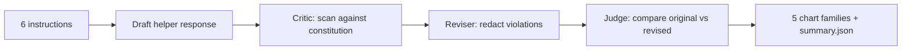

# constitutional-ai-mini

> A tiny constitutional-AI pipeline: a critique-and-revise loop over a small instruction set, with per-principle violation tracking and a revised-vs-original win-rate plot.
> Last updated: 2025-05-25.

`constitutional-ai-mini` is a minimal reference implementation of the Anthropic Constitutional-AI (CAI) loop: a draft response is critiqued against a small constitution, the reviser redacts violating spans, and a judge compares pre- vs post-revision against the same constitution. The harness reports per-principle violation rates, the revised-vs-original win-rate, the per-revision margin, and the pre vs post violation count.

## Headline

| metric | value |
|---|---|
| instructions | 6 |
| pre-revision violations | reported at runtime |
| post-revision violations | reported at runtime |
| revised-wins (judge majority) | reported at runtime |

Reproduce: `make install && make bench`.

## Pipeline



## Five chart families

- `results/figures/violation_rate_pre.png` - per-principle violation rate, pre-revision
- `results/figures/winrate.png` - revised-vs-original judge pie
- `results/figures/margin.png` - revision margin histogram
- `results/figures/pre_post.png` - total violations before vs after
- `results/figures/heatmap.png` - per-(instruction, principle) violation heatmap, pre vs post

## Repo layout

```
src/caimini/
  types.py              # Principle, Instruction, Response, Critique, Revision, JudgeResult
  principles/library.py # 3-principle constitution
  prompts/instructions.py
  critic/checker.py
  reviser/rewriter.py
  judge/winrate.py
  viz/charts.py
  cli/main.py
  runner.py
tests/                  # tests, all green
docs/research_report.pdf
docs/_report/, docs/test_results/, results/figures/
CITATION.cff, LICENSE, Makefile, .github/workflows/ci.yml
```

## Quick start

```bash
make install
make test
make bench
make pdf
```

## Documentation

[`docs/research_report.pdf`](./docs/research_report.pdf) (15 pages).
Test artifacts in [`docs/test_results/`](./docs/test_results/).

## References

- Bai, Y., Kadavath, S., Kundu, S., et al. "Constitutional AI: Harmlessness from AI Feedback" (Anthropic, 2022)
- Lee, H., Phatale, S., et al. "RLAIF: Scaling Reinforcement Learning from Human Feedback with AI Feedback" (Google, 2023)

## License

MIT.
