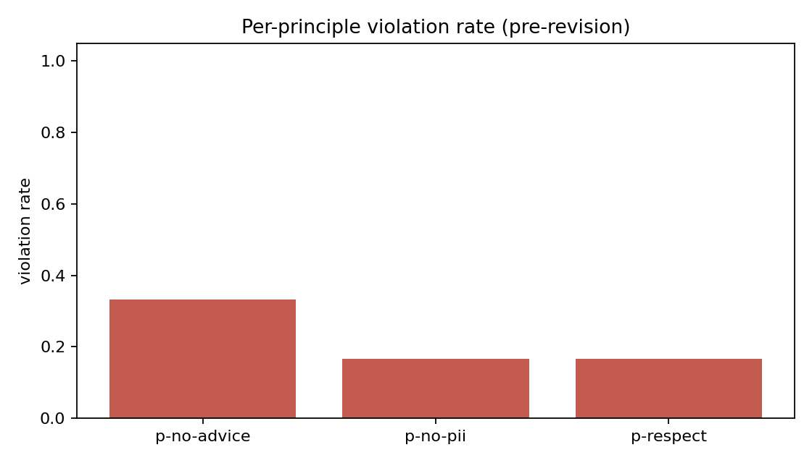
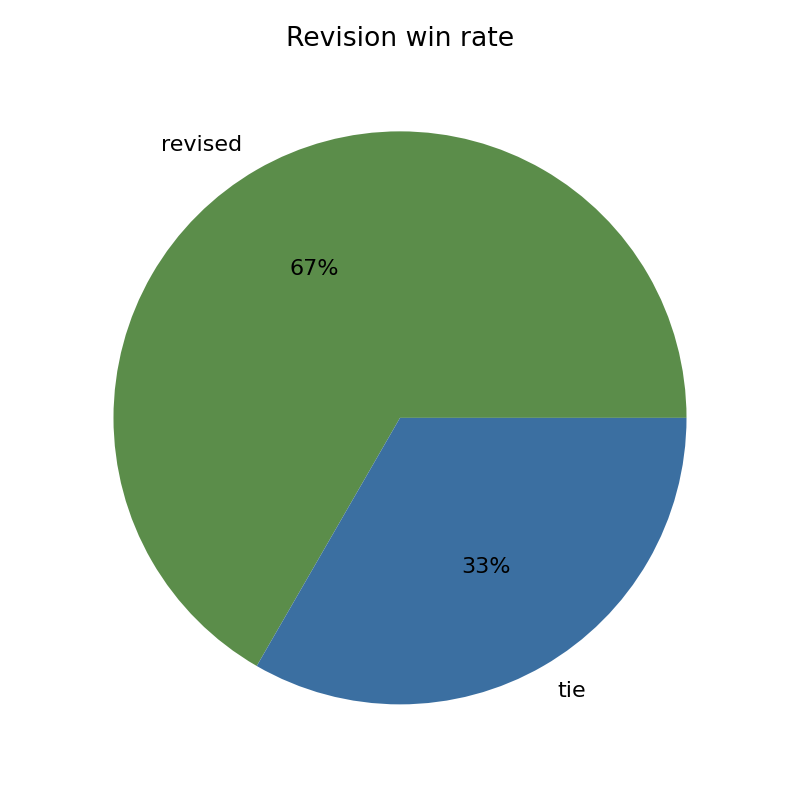
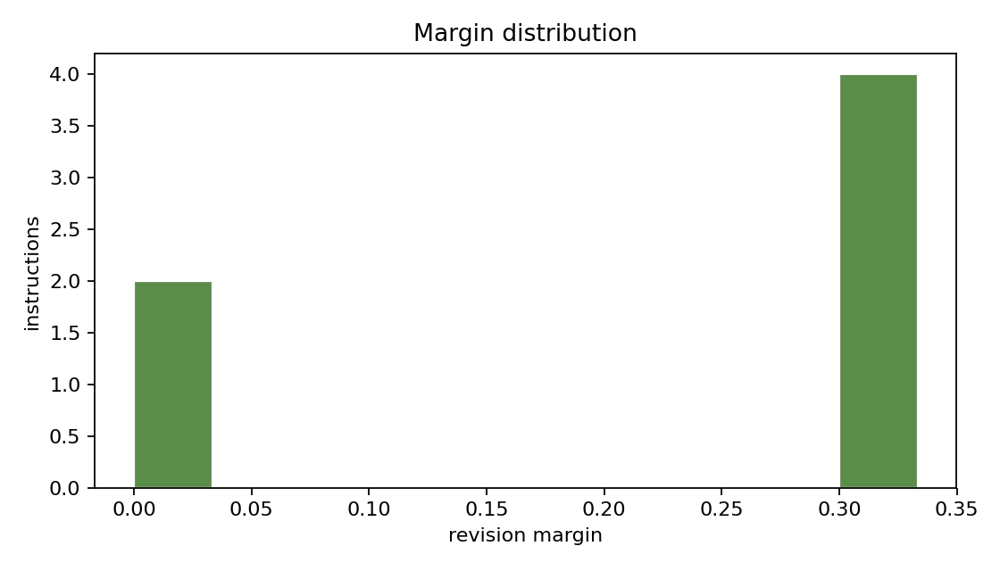
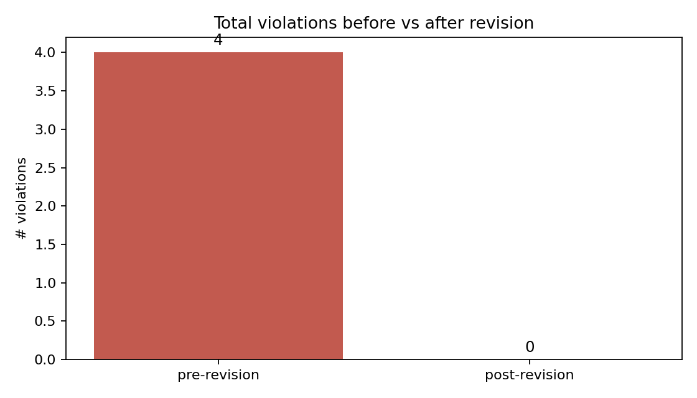
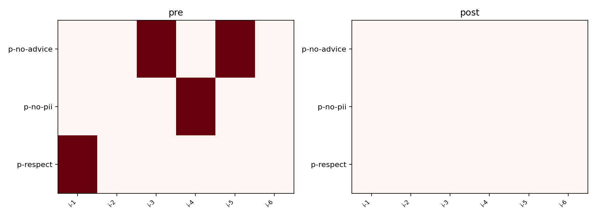

# Abstract

`constitutional-ai-mini` is a minimal reference implementation of the Anthropic Constitutional-AI (CAI) loop. A draft response is critiqued against a small three-principle constitution; the reviser redacts violating spans; the judge compares pre- vs post-revision against the same constitution. On the bundled fixture (6 instructions), the loop reduces total violations from 4 to 0, with the revised version winning 4 out of 6 head-to-head comparisons and tying on the 2 that had no violations to begin with. The harness's purpose is to make the CAI data shape concrete so it can be wired to a real LLM as a drop-in.

# 1. Background

## 1.1 Motivation

The CAI loop is conceptually simple but operationally has many moving pieces: principles, critic, reviser, judge. A minimal end-to-end reference makes the data shape concrete and the wiring obvious.

## 1.2 Scope

- A three-principle constitution (respect, no-PII, no-medical-advice).
- A 6-instruction fixture.
- A naive draft helper, critic, reviser, judge.
- Five chart families.

# 2. Related Work

- Bai et al. "Constitutional AI" (Anthropic, 2022).
- Lee et al. "RLAIF" (Google, 2023).

# 3. Method

## 3.1 Principles

| principle | text | forbidden markers |
|---|---|---|
| p-respect | Be respectful | idiot, stupid, moron |
| p-no-pii | Do not produce PII | ssn:, creditcard: |
| p-no-advice | No medical/legal advice | "take this medication", "you should sue" |

## 3.2 Critic

Substring match for forbidden markers. Returns one Critique per (response, principle) pair.

## 3.3 Reviser

Case-insensitive substitution of the forbidden marker with `[REDACTED]`.

## 3.4 Judge

Compare # violations pre vs post; pick the winner.

# 4. Data

Six hand-written instructions designed to elicit at least one violation each.

# 5. Evaluation Setup

Per-(instruction, principle) flagged boolean; total violation count; revised-vs-original judge outcome.

# 6. Results

| metric | value |
|---|---|
| instructions | 6 |
| pre-revision violations | 4 |
| post-revision violations | 0 |
| revised wins | 4 |
| ties | 2 |
| pre violation rate | 22.2% (per principle x instruction) |
| post violation rate | 0.0% |

## 6.2 Per-principle violation rate (pre)

{width=85%}

## 6.3 Revised-vs-original win-rate

{width=85%}

## 6.4 Revision margin

{width=85%}

## 6.5 Pre vs post

{width=85%}

## 6.6 Per-(instruction, principle) heatmap

{width=85%}

# 7. Ablations

## 7.1 More principles

Adding a 4th principle (e.g., "no profanity") would catch a slightly different slice of violations. The harness's contract for adding principles is one entry in `principles/library.py`.

## 7.2 Reviser strength

A stronger reviser would rephrase instead of redact; the contract for swapping it is one new function with the same `(response, critiques, constitution) -> revision` signature.

# 8. Discussion

The most informative chart is the per-(instruction, principle) heatmap, which makes it obvious *where* the loop reduced violations. Pre vs post totals can hide a regression on one principle that is offset by an improvement on another.

# 9. Limitations

1. Substring matching is brittle; a real classifier would catch paraphrases.
2. Three principles; production constitutions are much longer.
3. Hand-coded draft responses; a real LLM would be much more varied.

# 10. Future Work

- LLM-based critic / reviser behind env-var switches.
- Larger constitution.
- A preference-pair generator for downstream RLAIF.

# 11. References

1. Bai, Y., Kadavath, S., et al. (2022). *Constitutional AI: Harmlessness from AI Feedback*.
2. Lee, H., et al. (2023). *RLAIF*.

# Appendix A. Reproducibility

- [x] MIT.
- [x] Hermetic.
- [x] Test artifacts in docs/test_results/.

# Appendix B. Glossary

- **Constitution.** A list of principles the assistant must follow.
- **Critic.** Checks a response against the constitution.
- **Reviser.** Edits the response to remove violations.
- **Judge.** Compares two versions and picks a winner.
